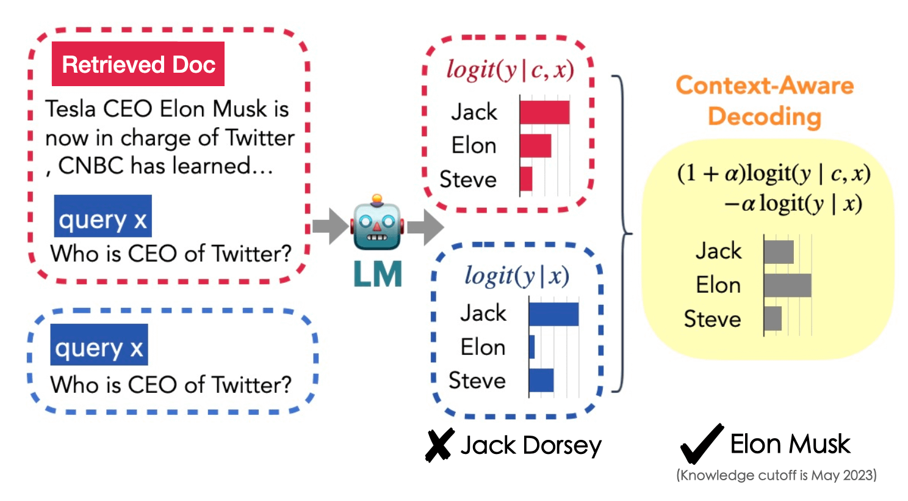

## Context-aware decoding
This repository provides an original implementation of [Trusting Your Evidence: Hallucinate Less with Context-aware Decoding](https://arxiv.org/pdf/2305.14739.pdf) by *Weijia Shi, *Xiaochuang Han, Mike Lewis, Yulia Tsvetkov, Luke Zettlemoyer, Scott Yih.

## Overview

Context-aware decoding is a simple inference-time method to encourage language models to focus more on given contexts. 

With regular decoding, we sample tokens at each position from an autoregressive language model with:
$$y_{t} \sim \text{softmax}[ \text{logit} ]$$

Context-aware decoding samples tokens at each position with:
$$y_t \sim \text{softmax}[(1+\alpha) \text{logit}_\theta(y_t \mid \boldsymbol{c}, \boldsymbol{x}, \boldsymbol{y}_{<t}) - \alpha \text{logit}_\theta(y_t \mid \boldsymbol{x}, \boldsymbol{y}_{<t})]$$

Here $\boldsymbol{c}$ denotes the context that the model should focus more on. Please see more details in [our paper](https://arxiv.org/abs/2305.14739). Here is an figure illustrating the difference between regular decoding and context-aware decoding.
<!--  -->



While context-aware decoding is based on the setup where one language model is decoded contrastively with different input contexts, *our code generally supports collaborative or contrastive decoding with multiple language models with different input contexts*. You can easily customize the inference setup with your own input `jsonl` file. 

### Input format
Below is an example input to our system (from NQ-Swap). 
```json
{
    "input_index": 0, // instances that decode together should have the same input_index
    "assigned_model": "huggyllama/llama-7b", // same model for all instances in context-aware decoding, but can use different models here, e.g., DExperts, contrastive decoding, proxy tuning, etc.
    "assigned_process": 0, // which GPU should take this instance
    "context_string": "The fourth season of Chicago Fire , an American drama television series with executive producer Dick Wolf , and producers Derek Haas , Michael Brandt , and Matt Olmstead , was ordered on February 5 , 2015 , by NBC , and premiered on October 13 , 2015 and concluded on May 17 , 2016 . The season contained 1078 episodes . How many episodes are in chicago fire season 4 ?", // the context-aware input
    "assigned_weight": 2, // weight for current instance/process (1+alpha, weights should add up to 1 by default, but can also incorporate sampling temperature if needed)
    "filter_p": 1.0, // optional filtering for low-probablity tokens, disabled by default
}
{
    "input_index": 0, // instances that decode together should have the same input_index
    "assigned_model": "huggyllama/llama-7b", // same model for all instances in context-aware decoding, but can use different models here, e.g., DExperts, contrastive decoding, proxy tuning, etc.
    "assigned_process": 1, // which GPU should take this instance
    "context_string": "How many episodes are in chicago fire season 4 ?", // the context-unaware input
    "assigned_weight": -1, // weight for current instance/process (-alpha, weights should add up to 1 by default, but can also incorporate sampling temperature if needed)
}
...
```

### Running context-aware decoding on CNN-DM and NQ-Swap
Run `bash exp_cnndm.sh` or `bash exp_nqswap.sh`. Both scripts call `run_group_decode_fileio.sh` which subsequently calls `group_decode_fileio.py`. The output will be saved in the same directory as the input files. 

The conda environment we used can be found in `environment.yml`. The main packages used are `pytorch`, `transformers`, and `accelerate`. 

### Evaluation
After generating the prediction data, you can run the evaluation by running the following script and compare with the gold data.  
```bash
PRED_PATH=./eval/cnndm_example_input/cnndm_1.5_-0.5.jsonl.output_topp0.9_genlen100.jsonl 
GOLD_DATA_PATH=./eval/cnndm_example_input/cnndm_1_0.jsonl
python eval/evaluate_summary.py --pred_path $PRED_PATH --data_path $GOLD_DATA_PATH
```
We provide our output for CNN-DM using standard decoding (`cnndm_1_0.jsonl.output_topp0.9_genlen100`) and context-aware decoding (`cnndm_1.5_-0.5.jsonl.output_topp0.9_genlen100.jsonl`) in `eval/cnndm_example_input/`.
